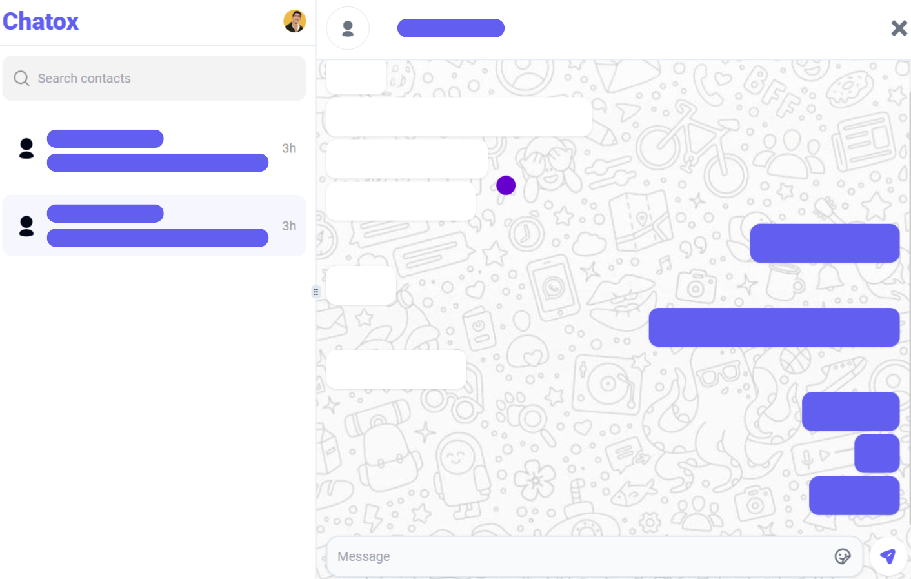
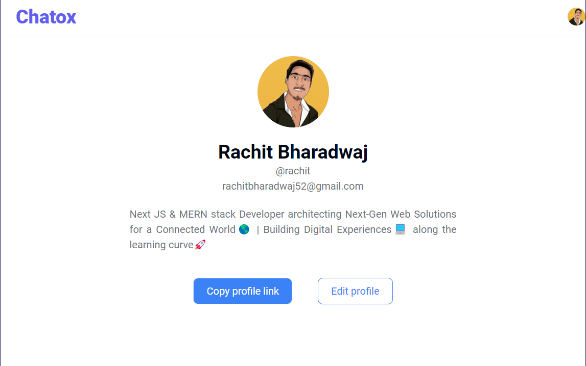

# Chatox - Real-time Chat Web-app


## Description

Chat Application is a web-based platform where users can register, search for people by name, email, or username, and chat with them in real-time. Users can also edit their profiles to include a bio and a profile picture. The application is free to use and available online.

### Features

- User Registration and Login
- Real-time Chatting
- User Search by Name/Email/Username
- Profile Customization
- Responsive design for all screens

## Snapshots

<div style="display: flex; justify-content: space-evenly; flex-wrap: wrap; gap: 2rem">
  
  
  
</div>

## Live Demo and Source Code

- **Live URL:** [https://chatox-vzh5.onrender.com](https://chatox-vzh5.onrender.com)
- **GitHub URL:** [https://github.com/rachit-bharadwaj/chatox](https://github.com/rachit-bharadwaj/chatox)

## Technologies Used

### Frontend

<div style="justify-content: space-evenly; display: flex;">
  
  
  
  
  
</div>

### Backend

<div style="justify-content: space-evenly; display: flex; gap: 10px">
  
  
  
  
  
  
</div>

### Tools

<div style="justify-content: space-evenly; display: flex;">
  
  
  
  
  
</div>

## Installation

1. Clone the repository:

   ```bash
   git clone https://github.com/rachit-bharadwaj/chatox.git
   ```

2. Install dependencies:

   ```bash
   cd chatox/server
   npm install
   cd ../client
   npm install
   ```

3. Update the backend URL in the constants file.

4. Run the development server:
   ```bash
   cd ../server
   npm run dev
   cd ../client
   npm run dev
   ```

## License

This project is licensed under the [MIT License](LICENSE), allowing contributions but restricting commercial use.

## Contact

For any queries or more such projects, visit my portfolio: [https://rachit.infornics.com](https://rachit.infornics.com)
